## Quantifying Alzheimer's Disease Progression Through Automated Measurement of Hippocampal Volume

Alzheimer's disease (AD) is a progressive neurodegenerative disorder that results in impaired neuronal (brain cell) function and eventually, cell death. AD is the most common cause of dementia. Clinically, it is characterized by memory loss, inability to learn new material, loss of language function, and other manifestations. 

For patients exhibiting early symptoms, quantifying disease progression over time can help direct therapy and disease management. 

A radiological study via MRI exam is currently one of the most advanced methods to quantify the disease. In particular, the measurement of hippocampal volume has proven useful to diagnose and track progression in several brain disorders, most notably in AD. Studies have shown reduced volume of the hippocampus in patients with AD.

The hippocampus is a critical structure of the human brain (and the brain of other vertebrates) that plays important roles in the consolidation of information from short-term memory to long-term memory. In other words, the hippocampus is thought to be responsible for memory and learning (that's why we are all here, after all!)


Humans have two hippocampi, one in each hemishpere of the brain. They are located in the medial temporal lobe of the brain. Fun fact - the word "hippocampus" is roughly translated from Greek as "horselike" because of the similarity to a seahorse, a peculiarity observed by one of the first anatomists to illustrate the structure.


According to [studies](https://www.sciencedirect.com/science/article/pii/S2213158219302542), the volume of the hippocampus varies in a population, depending on various parameters, within certain boundaries, and it is possible to identify a "normal" range when taking into account age, sex and brain hemisphere. 


There is one problem with measuring the volume of the hippocampus using MRI scans, though - namely, the process tends to be quite tedious since every slice of the 3D volume needs to be analyzed, and the shape of the structure needs to be traced. The fact that the hippocampus has a non-uniform shape only makes it more challenging. Do you think you could spot the hippocampi in this axial slice?


As you might have guessed by now, we are going to build a piece of AI software that could help clinicians perform this task faster and more consistently.

You have seen throughout the course that a large part of AI development effort is taken up by curating the dataset and proving clinical efficacy. In this project, we will focus on the technical aspects of building a segmentation model and integrating it into the clinician's workflow, leaving the dataset curation and model validation questions largely outside the scope of this project. You will build an end-to-end AI system which features a machine learning algorithm that integrates into a clinical-grade viewer and automatically measures hippocampal volumes of new patients, as their studies are committed to the clinical imaging archive.


## The Dataset

We are using the "Hippocampus" dataset from the [Medical Decathlon competition](http://medicaldecathlon.com/). This [dataset](https://github.com/udacity/nd320-c3-3d-imaging-starter/tree/master/data/TrainingSet) is stored as a collection of NIFTI files, with one file per volume, and one file per corresponding segmentation mask. The original images here are T2 MRI scans of the full brain. As noted, in this dataset we are using cropped volumes where only the region around the hippocampus has been cut out. This makes the size of our dataset quite a bit smaller, our machine learning problem a bit simpler and allows us to have reasonable training times. You should not think of it as "toy" problem, though. Algorithms that crop rectangular regions of interest are quite common in medical imaging. Segmentation is still hard.

## The Programming Environment

You will have two options for the environment to use throughout this project:

### Udacity Workspaces

#### Running EDA in Udacity Workspace for Section 1

**Step 1: Launch Jupyter Notebook**

Open and execute the EDA notebook to perform data exploration and cleaning:

```bash
cd /home/workspace/
jupyter notebook --port 3002 --ip=0.0.0.0 --allow-root
```

**Step 2: Execute All Cells**

Run all cells in the notebook to:
- Explore the hippocampus dataset
- Analyze volume distributions and statistics
- Clean and validate the data
- Generate the cleaned dataset in the `out` folder

**Step 3: Download the out folder**

After successful execution, download the `out` folder containing the cleaned dataset. This folder will be used in Section 2 for model training.

#### Running the ML Pipeline in Udacity Workspace for Section 2

**Step 1: Upload the out folder**

Upload the `out` folder (containing the clean dataset from Section 1) to the section 2 workspace.

**Step 2: Run the ML Training Pipeline**

```bash
cd src
python run_ml_pipeline.py
```

**Step 3: Launch TensorBoard**

To monitor training progress in real-time, launch TensorBoard from the same directory:

```bash
tensorboard --logdir runs --bind_all
```

Then access TensorBoard in your browser at the provided URL.

#### Running the System in Udacity Workspace for section 3

The Udacity workspace is pre-configured with all necessary tools. To run the complete inference pipeline with PACS integration:  

**Step 1: Launch Services (in separate terminals)**

```bash
# Terminal 1 - Start Orthanc PACS server
./launch_orthanc.sh

# Terminal 2 - Start OHIF viewer
./launch_OHIF.sh
```

**Step 2: Install DICOM Tools (first time only)**

```bash
apt-get install dcmtk
```

**Step 3: Test DICOM Routing**

```bash
./deploy_scripts/send_volume.sh
```

**Step 4: Run Inference**

Option A - Single study inference:
```bash
python inference_dcm.py /data/TestVolumes/Study1
```

Option B - Batch processing (multiple studies in parallel):
```bash
python batch_inference_dcm.py /data/TestVolumes --send-to-orthanc
```

The reports will be automatically sent to Orthanc PACS and viewable in the OHIF viewer.

### Local Environment

If you would like to run the project locally, you would need a Python 3.7+ environment with the following libraries for the first two sections of the project:

* nibabel
* matplotlib
* numpy
* pydicom
* PIL
* json
* torch (preferably with CUDA)
* tensorboard

In the 3rd section of the project we will be working with three software products for emulating the clinical network. You would need to install and configure:

* [Orthanc server](https://www.orthanc-server.com/download.php) for PACS emulation
* [OHIF zero-footprint web viewer](https://docs.ohif.org/development/getting-started.html) for viewing images. Note that if you deploy OHIF from its github repository, at the moment of writing the repo includes a yarn script (`orthanc:up`) where it downloads and runs the Orthanc server from a Docker container. If that works for you, you won't need to install Orthanc separately.
* If you are using Orthanc (or other DICOMWeb server), you will need to configure OHIF to read data from your server. OHIF has instructions for this: https://docs.ohif.org/configuring/data-source.html
* In order to fully emulate the Udacity workspace, you will also need to configure Orthanc for auto-routing of studies to automatically direct them to your AI algorithm. For this you will need to take the script that you can find at `section3/src/deploy_scripts/route_dicoms.lua` and install it to Orthanc as explained on this page: https://book.orthanc-server.com/users/lua.html
* [DCMTK tools](https://dcmtk.org/) for testing and emulating a modality. Note that if you are running a Linux distribution, you might be able to install dcmtk directly from the package manager (e.g. `apt-get install dcmtk` in Ubuntu)


**Workspace 3**. This workspace is a simpler hardware, with no GPU, which is more representative of a clinical environment. This workspace also has a few tools installed in it, which is replicates the following clinical network setup:  


**Resource might help:** For a detailed guide on clinical workflow integration with Orthanc and OHIF Viewer, see [this article](https://medium.com/@GaganaB/clinical-workflow-integration-with-orthanc-and-ohif-viewer-38930a3e94de).

Specifically, we have the following software in this setup:

* MRI scanner is represented by a script `section3/src/deploy_scripts/send_volume.sh`. When you run this script it will simulate what happens after a radiological exam is complete, and send a volume to the clinical PACS. Note that scanners typically send entire studies to archives.
* PACS server is represented by [Orthanc](http://orthanc-server.com/) deployment that is listening to DICOM DIMSE requests on port 4242. Orthanc also has a DicomWeb interface that is exposed at port 8042, prefix /dicom-web. There is no authentication and you are welcome to explore either one of the mechanisms of access using a tool like curl or Postman. Our PACS server is also running an auto-routing module that sends a copy of everything it receives to an AI server. See instructions ad the end of this page on how to launch if you are using the Udacity Workspace.  
* Viewer system is represented by [OHIF](http://ohif.org/). It is connecting to the Orthanc server using DicomWeb and is serving a web application on port 3000. Again, see instructions at the end of this page if you are using the Udacity Workspace.
* AI server is represented by a couple of scripts. `section3/src/deploy_scripts/start_listener.sh` brings up a DCMTK's `storescp` and configures it to just copy everything it receives into a directory that you will need to specify by editing this script, organizing studies as one folder per study. HippoVolume.AI is the AI module that you will create in this section.  

## Technology Stack

| Component | Technology | Purpose |
|-----------|-----------|---------|
| **Deep Learning** | PyTorch 1.4 | Model training & inference |
| **Architecture** | 2D UNet | Segmentation network |
| **Medical I/O** | MedPy, PyDicom | NIFTI & DICOM handling |
| **Parallelization** | ThreadPoolExecutor, ProcessPoolExecutor | I/O & compute optimization |
| **Visualization** | TensorBoard, PIL | Training monitoring & reports |
| **PACS Integration** | Orthanc, DCMTK | Clinical deployment |
| **Data Science** | NumPy, SciPy | Array operations |
---

## System Flow Diagram


## Model Performance

The baseline **2D UNet model** achieves excellent performance on hippocampus segmentation:

| Metric | Score |
|--------|-------|
| **Mean Dice Coefficient** | **0.8928** |
| Architecture | 2D UNet (Recursive) |
| Classes | 3 (Background, Anterior, Posterior) |
| Patch Size | 64×64 |
| Training Epochs | 10 |
| Optimizer | Adam (lr=0.0002) |

This performance demonstrates the model is **production-ready** for clinical deployment. The Dice score of [0.8928](section2/out/2025-12-03_0609_Basic_unet/results.json) indicates strong overlap between predicted and ground truth hippocampal segmentations, which is considered excellent for medical image segmentation tasks.

**Key Optimizations:**
- Parallel data loading with ProcessPoolExecutor
- GPU acceleration with Automatic Mixed Precision (AMP)
- Batched inference for efficiency
- Parallel DICOM processing in deployment pipeline
- Batch study processing for multi-study throughput (2-8× parallel speedup, 10-20× vs. baseline clinical workflow)

> **Note:** Experimental features like Test-Time Augmentation (TTA) and 3D morphological post-processing were tested but removed as they decreased performance. The baseline 2D UNet without augmentation provides the best results.

| Optimization | Speedup | Impact Area | File(s) Modified |
|--------------|---------|-------------|------------------|
| Parallel Data Loading | 3-8x | Data loading, training | `HippocampusDatasetLoader.py`, `UNetExperiment.py` |
| Mixed Precision Training (AMP) | 2-3x | Training | `UNetExperiment.py`, `run_ml_pipeline.py` |
| Batched Inference | 5-10x | Testing, deployment | `inference/UNetInferenceAgent.py` |
| Parallel DICOM Loading | 3-5x | Study ingestion (single study) | `inference_dcm.py` |
| Parallel Report Generation | 2-3x | Report creation (single study) | `inference_dcm.py` |
| **Batch Study Processing** | **N×** | **Multi-study throughput** | `batch_inference_dcm.py` |
| Multi-Process Parallelism | 2-8x | Concurrent study processing | `batch_inference_dcm.py` (ProcessPoolExecutor) |
| Hierarchical Parallelization | 1.5-3x | Combined study + I/O parallelism | `batch_inference_dcm.py` (Process + Thread pools) |

**Combined Effect**: 
- Training time reduced by ~5-10x
- Single study inference time reduced by 5-10x
- **Batch processing throughput: N studies can be processed in ~N/max_workers time** (e.g., 10 studies with 4 workers ≈ 2.5× single study time)
- Clinical workflow time reduced by ~5-8x for typical studies, **10-20x for batch operations**

---

## TensorBoard — Images


## TensorBoard — Scalars


## OHIF Viewer displaying a study and segmentation results


## Parallelization Strategy


| Task | Location | Executor Type | Reason |
|------|----------|---------------|---------|
| **Volume calculation** | Section 1 | ProcessPoolExecutor | CPU-bound (numpy, decompression) |
| **File copying** | Section 1 | ProcessPoolExecutor | CPU-bound (large file I/O + verification) |
| **NIFTI loading** | Section 2 | ProcessPoolExecutor | Mixed (I/O + heavy CPU from .gz decompression) |
| **DICOM loading** | Section 3 (inference_dcm.py) | ThreadPoolExecutor | I/O-bound (simple file reading) |
| **Report generation** | Section 3 (inference_dcm.py) | ThreadPoolExecutor | GIL-released (PIL/numpy operations) |
| **Batch study processing** | Section 3 (batch_inference_dcm.py) | ProcessPoolExecutor | Study-level parallelism (bypasses Python GIL, independent processes) |
| **Per-study DICOM loading** | Section 3 (batch_inference_dcm.py) | ThreadPoolExecutor | I/O-bound (inherited from inference_dcm.py functions) |
| **Per-study report generation** | Section 3 (batch_inference_dcm.py) | ThreadPoolExecutor | GIL-released (inherited from inference_dcm.py functions) |

---

## Performance Metrics


## 2. Class Diagram - Section 2 (Training)

The `Config` class holds hyperparameters that configure the `UNetExperiment`, which orchestrates the entire training workflow. The experiment uses `HippocampusDatasetLoader` with `ProcessPoolExecutor` for parallel NIFTI loading, feeds data through `SlicesDataset` to PyTorch's `DataLoader`, and trains the recursive `UNet` model composed of `UnetSkipConnectionBlock` layers. The `UNetInferenceAgent` performs test-time inference, while `VolumeStats` computes Dice and Jaccard metrics for model evaluation.


---

## 3. Class Diagram - Section 3 (Deployment)


This diagram shows the deployment architecture integrating with clinical PACS systems. The `inference_dcm` script orchestrates the entire workflow: using `ThreadPoolExecutor` for parallel DICOM I/O, `PyDicom` for reading medical images, `UNetInferenceAgent` with the trained `UNet` model for hippocampus segmentation, `PIL_Image` for generating visual reports, and finally sending results to `Orthanc` PACS via DICOM C-STORE protocol for clinical review.

---

## 4. Sequence Diagram - Training Pipeline


---

## 5. Sequence Diagram - Inference Pipeline


---

## 6. Sequence Diagram - DICOM Deployment

```mermaid
sequenceDiagram
    participant Orthanc as Orthanc PACS
    participant Script as inference_dcm.py
    participant Loader as DICOM Loader
    participant Pool as ThreadPoolExecutor
    participant Agent as UNetInferenceAgent
    participant Model as UNet
    participant Report as Report Generator
    
    Orthanc->>Script: Route study to /data/incoming
    Script->>Script: Find subdirectories
    Script->>Script: Filter HCropVolume directories
    
    Script->>Loader: get_series_for_inference(study_dir)
    Loader->>Loader: list all .dcm files
    
    Loader->>Pool: Create ThreadPoolExecutor
    loop for each DICOM file (parallel)
        Pool->>Pool: process_single_dicom(file_path)
        Pool->>Pool: pydicom.dcmread(file_path)
    end
    Pool-->>Loader: list of DICOM objects
    
    Loader->>Loader: filter by SeriesDescription
    Loader-->>Script: series_for_inference list
    
    Script->>Script: load_dicom_volume_as_numpy_from_list()
    Script->>Script: construct 3D volume [X, Y, Z]
    
    Script->>Agent: UNetInferenceAgent(parameter_file_path)
    Script->>Agent: single_volume_inference_unpadded(volume)
    
    Agent->>Agent: reshape volume to patch_size
    loop for each slice batch
        Agent->>Model: forward(batch)
        Model-->>Agent: predictions
    end
    Agent-->>Script: prediction_volume [X, Y, Z]
    
    Script->>Script: get_predicted_volumes(pred)
    Script->>Script: compute anterior, posterior, total volumes
    
    Script->>Report: create_report(inference, header, orig_vol, pred_vol)
    Report->>Pool: Create ThreadPoolExecutor
    loop for 3 slices (parallel)
        Pool->>Pool: process_single_slice_for_report()
        Pool->>Pool: normalize, colorize, composite
    end
    Pool-->>Report: 3 processed slice images
    Report->>Report: combine into final report
    Report-->>Script: report PIL.Image
    
    Script->>Script: save_report_as_dcm(header, report, path)
    Script->>Orthanc: storescu 127.0.0.1 4242 (DICOM C-STORE)
    
    Script->>Script: cleanup study directory
    Script-->>Orthanc: Inference complete
```



---

## 7. Class Diagram - Batch Processing


This diagram illustrates the high-throughput batch processing architecture for processing multiple studies concurrently. `batch_inference_dcm` orchestrates study-level parallelism using `ProcessPoolExecutor` (bypassing Python's GIL), while reusing `inference_dcm`functions for per-study DICOM loading and report generation. `BatchProcessingStats` tracks success/failure rates, timing, and `subprocess` handles DICOM C-STORE operations to `Orthanc_PACS` with timeout protection for robust clinical deployment.

---

## 8. Sequence Diagram - Batch Processing Pipeline


---

## 9. Activity Diagram - Batch Processing Flow


---

## 10. State Diagram - Study Processing States


---

**Validation Plan:** For detailed clinical validation procedures and FDA submission guidelines, see [VALIDATION_PLAN.md](section3/out/VALIDATION_PLAN.md).

## Demo on CPU Hardware

### Study Ingestion (Single Study)


*Single study processing with inference_dcm.py showing real-time progress through DICOM loading, volume construction, inference, and report generation.*

### Batch Study Processing


*Parallel batch processing with batch_inference_dcm.py demonstrating concurrent processing of multiple studies with aggregate statistics and performance metrics.*
